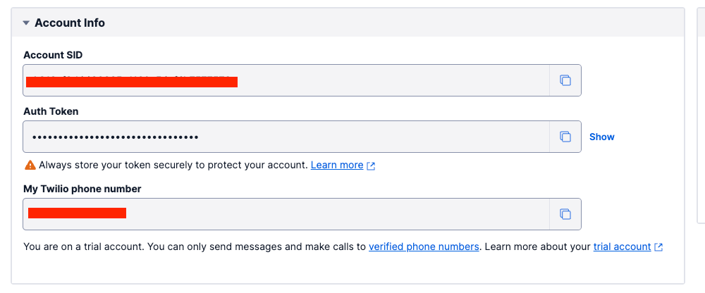

# Toons API 서버
## 목차
- [실행 방법](#실행 방법)
- [작성자](#authors)
- [라이센스](#license)
<!--  Other options to write Readme
  - [Deployment](#deployment)
  - [Used or Referenced Projects](Used-or-Referenced-Projects)
-->
## 프로젝트 설명
toons.jinwoo.space 에서 사용하는 API 서버입니다. 네이버 웹툰, 카카오 웹툰을 크롤링하여 데이터를 저장하고 
완결 알림 기능을 제공합니다. 


## 실행 방법
### Twilio
1. [Twilio](https://www.twilio.com/) 에서 회원가입
2. 다음의 키값 확인  
### Google, Kakao 로그인 설정
* [구글 로그인](https://deeplify.dev/back-end/spring/oauth2-social-login#%EA%B5%AC%EA%B8%80-oauth-%EC%84%9C%EB%B9%84%EC%8A%A4-%EB%93%B1%EB%A1%9D)
* [카카오 로그인](https://deeplify.dev/back-end/spring/oauth2-social-login#%EC%B9%B4%EC%B9%B4%EC%98%A4-oauth-%EC%84%9C%EB%B9%84%EC%8A%A4-%EB%93%B1%EB%A1%9D)
### MariaDB 및 Redis 설정
```shell
docker-compose up -d --build
```
> Docker 가 설치되어있는 환경이어야합니다.

## Authors
- **정진우** - <jwjung5038@gmail.com> [Blog](https://jinwoo.space) [Profile](https://github.com/Jiinwoo)
## License

```
MIT License

Copyright (c) 2022 jung jin woo

Permission is hereby granted, free of charge, to any person obtaining a copy
of this software and associated documentation files (the "Software"), to deal
in the Software without restriction, including without limitation the rights
to use, copy, modify, merge, publish, distribute, sublicense, and/or sell
copies of the Software, and to permit persons to whom the Software is
furnished to do so, subject to the following conditions:

The above copyright notice and this permission notice shall be included in all
copies or substantial portions of the Software.

THE SOFTWARE IS PROVIDED "AS IS", WITHOUT WARRANTY OF ANY KIND, EXPRESS OR
IMPLIED, INCLUDING BUT NOT LIMITED TO THE WARRANTIES OF MERCHANTABILITY,
FITNESS FOR A PARTICULAR PURPOSE AND NONINFRINGEMENT. IN NO EVENT SHALL THE
AUTHORS OR COPYRIGHT HOLDERS BE LIABLE FOR ANY CLAIM, DAMAGES OR OTHER
LIABILITY, WHETHER IN AN ACTION OF CONTRACT, TORT OR OTHERWISE, ARISING FROM,
OUT OF OR IN CONNECTION WITH THE SOFTWARE OR THE USE OR OTHER DEALINGS IN THE
SOFTWARE.
```